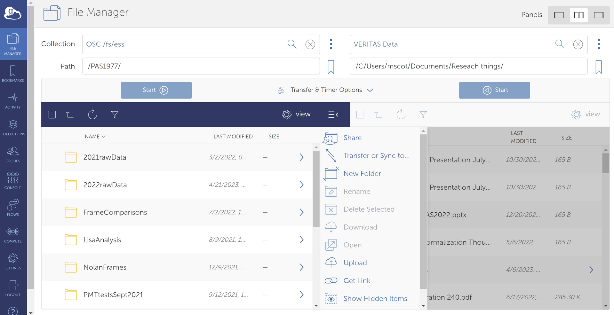

# Some Extra Commands and Details  

## Awk and Grep  

To mass remove files. BE VERY CAREFULLY: 

    ls -1 */*/*/*.out | awk -F /Z '{print "rm " $1}' > BadFilesToDelete.txt

## Globus

To transfer large files one can do this easily with Globus. 

You can easily download an account at the [Globus Website](https://www.globus.org/) which will allow you to transfer files to and from the OSC, CHPC and other similar systems. Set up and "endpoint" on your machine which will allow you to transfer files. 

