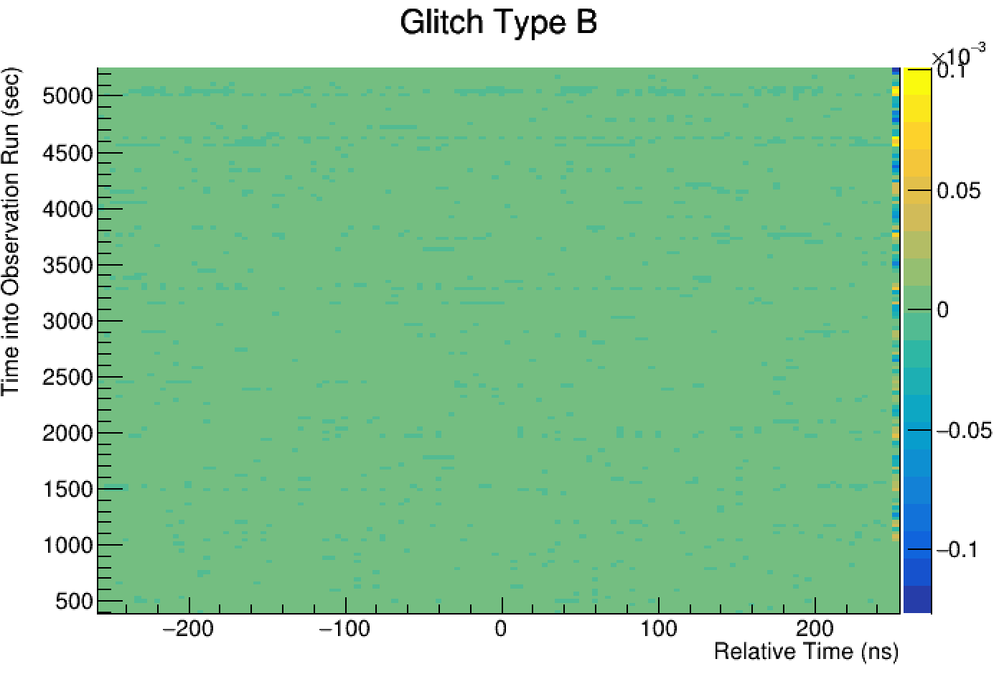

# FPGA Gltiches 

There are two types of known glitches in FPGA correlations. Type A glitches result from a mis-match of the actual correaltion with the average ADCs. The correlations are theorteically fine but can not be properly normalized. We can use forced normalization to crrect for this. Type B glitches (I think. Ask Nolan) occur from incorrect calcualtion of the Num buckets offset/ some time the correlations. but what is true is that they can not easily be corrected for in post correlation analysis and therefore must either be discarded or recorrelated. Type B correlations are incorrect from the beginning of the run where Type A "go wrong" at some undefined point the run.  

### Type A Example 

### Type B Example 

